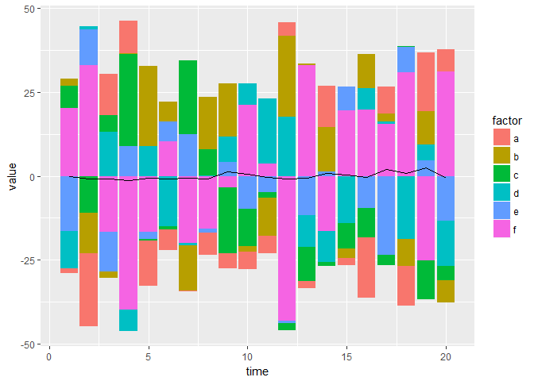
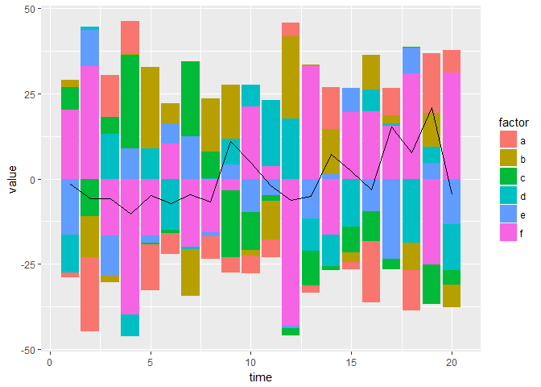
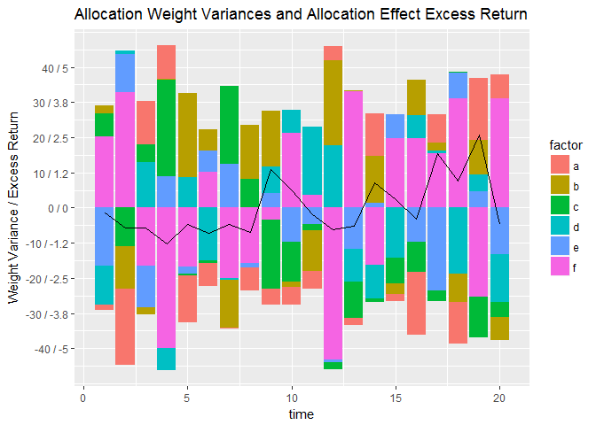

# Dual y axis
Karl Polen  
August 3, 2016  

Plotting excess return from allocation effect over a stacked bar chart of allocation deltas.


```r
require(ggplot2)
require(reshape2)

#create some fake data
excess=rnorm(20,mean=0,sd=1)
yexpos=max(excess)
yexneg=max(-excess)
time=1:20
excess=data.frame(time,excess)
alloc=rnorm(100,mean=0,sd=10)
alloc=matrix(alloc,ncol=5)
alloc=cbind(alloc,-rowSums(alloc))
colnames(alloc)=c("a","b","c","d","e","f")
allocpos=alloc*subset(alloc>0)
ypos = max(rowSums(allocpos))
allocneg=alloc*subset(alloc<=0)
yneg=max(rowSums(-allocneg)) 
allocpos=data.frame(time,allocpos)
allocneg=data.frame(time,allocneg)
allocpos=melt(allocpos,id.vars="time")
allocneg=melt(allocneg,id.vars="time")
colnames(allocpos)=c("time","factor","value")
colnames(allocneg)=c("time","factor","value")

#plot without scaling
ggplot()+
  geom_bar(data=allocpos,aes(x=time,y=value,fill=factor),stat="identity")+
  geom_bar(data=allocneg,aes(x=time,y=value,fill=factor),stat="identity")+
  geom_line(data=excess,aes(x=time,y=excess))
```

<!-- -->

```r
#pick a scaling factor and plot with scaling
y1=max(yneg,ypos)
y2=max(yexpos,yexneg)
scalefactor=floor((y1/y2)/2) 
excess.scaled=excess
excess.scaled$excess=excess$excess*scalefactor
ggplot()+
  geom_bar(data=allocpos,aes(x=time,y=value,fill=factor),stat="identity")+
  geom_bar(data=allocneg,aes(x=time,y=value,fill=factor),stat="identity")+
  geom_line(data=excess.scaled,aes(x=time,y=excess))
```

<!-- -->

```r
#customize the ticks
niceticks=c(.001,.01,1,2.5,5,10,20,25,50,100)
interval=niceticks[which.min(abs(4-y1/niceticks))]
ticksup=floor(ypos/interval)
ticksdown=floor(yneg/interval)
ticks=interval*(-ticksdown:ticksup)
ticklabel=paste(ticks,'/', round(ticks/scalefactor,1))
ggplot()+
  geom_bar(data=allocpos,aes(x=time,y=value,fill=factor),stat="identity")+
  geom_bar(data=allocneg,aes(x=time,y=value,fill=factor),stat="identity")+
  geom_line(data=excess.scaled,aes(x=time,y=excess))+
  scale_y_continuous("Weight Variance / Excess Return",breaks=ticks,labels=ticklabel)+
  ggtitle("Allocation Weight Variances and Allocation Effect Excess Return")
```

<!-- -->

